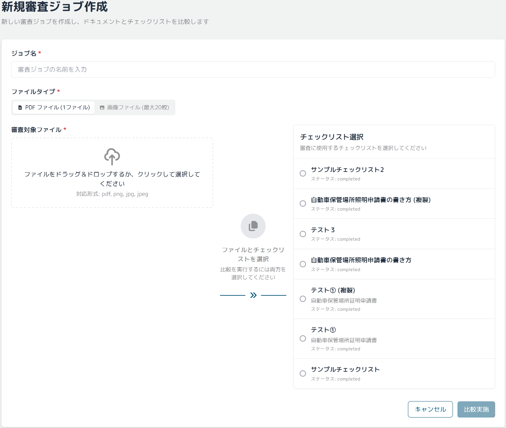
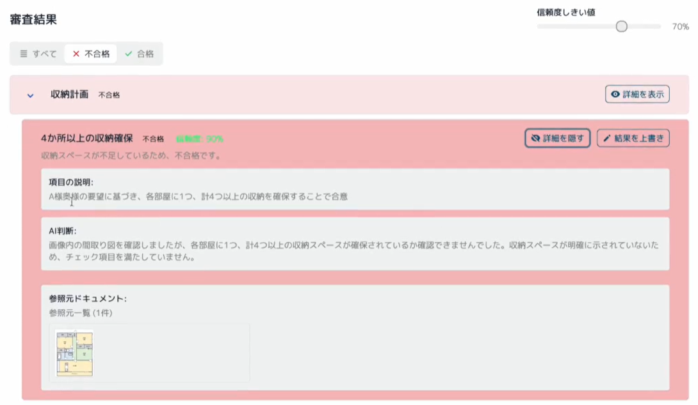

# Review & Assessment Powered by Intelligent Documentation

[English](./README_en.md) | [日本語](../../README.md)

This sample is a document review solution powered by generative AI (Amazon Bedrock). It streamlines review processes involving extensive documents and complex checklists using a Human in the Loop approach. It supports the entire process from checklist structuring to AI-assisted review and final human judgment, reducing review time and improving quality.


> [!Important]
> This tool is intended only for decision support and does not provide professional judgment or legal advice. All final judgments must be made by qualified human experts.

> [!Warning]
> This sample may undergo breaking changes without prior notice.

## Key Use Cases

### Product Specification Compliance Review

Efficiently verify that product development specifications meet requirements and industry standards. Automate the process of comparing thousands of specifications annually against hundreds of checkpoints. AI extracts and structures relevant information from specifications, visualizing compliance results. Reviewers can efficiently perform final verification.

### Technical Manual Quality Verification

Verify that complex technical manuals comply with internal guidelines and industry standards. Support the process of comparing tens of thousands of pages of technical documentation annually against thousands of quality criteria. Automatically detect missing technical information and inconsistencies, supporting the creation of consistent, high-quality manuals.

### Procurement Document Compliance Verification

Check that procurement documents and proposals meet necessary requirements. Automatically extract required information from documents spanning hundreds of pages, streamlining thousands of document reviews annually. Improve procurement process speed and accuracy by having humans verify compliance results against requirement lists.

## Screenshots






## Deployment Methods

There are two methods for deployment:

### 1. Deployment Using CloudShell (For Those Who Want to Start Easily)

This method allows you to deploy directly from your browser using AWS CloudShell without preparing a local environment.

1. **Enable Amazon Bedrock Models**

   Access [Bedrock Model Access](https://us-west-2.console.aws.amazon.com/bedrock/home?region=us-west-2#/modelaccess) from the AWS Management Console and enable access to the following models:

   - Anthropic Claude 3.7 Sonnet
   - Amazon Nova Premier

   Enable model access in the Oregon (us-west-2) region.

2. **Open AWS CloudShell**

   Open [AWS CloudShell](https://console.aws.amazon.com/cloudshell/home) in the region where you want to deploy.

3. **Run the Deployment Script**

   ```bash
   git clone https://github.com/aws-samples/review-and-assessment-powered-by-intelligent-documentation.git
   cd review-and-assessment-powered-by-intelligent-documentation
   ./bin.sh
   ```

   This script automatically deploys the application using CloudShell.

4. **Specify Custom Parameters (Optional)**

   ```bash
   ./bin.sh --ipv4-ranges '["192.168.0.0/16"]'
   ```

   Available options:

   - `--ipv4-ranges`: IPv4 address ranges to allow in the frontend WAF (JSON array format)
   - `--ipv6-ranges`: IPv6 address ranges to allow in the frontend WAF (JSON array format)
   - `--disable-ipv6`: Disable IPv6 support
   - `--auto-migrate`: Whether to automatically run database migration during deployment
   - `--cognito-self-signup`: Whether to enable self-signup for the Cognito User Pool (true/false)
   - `--cognito-user-pool-id`: Existing Cognito User Pool ID (creates new if not specified)
   - `--cognito-user-pool-client-id`: Existing Cognito User Pool Client ID (creates new if not specified)
   - `--cognito-domain-prefix`: Prefix for the Cognito domain (auto-generated if not specified)
   - `--repo-url`: URL of the repository to deploy
   - `--branch`: Branch name to deploy

5. **Post-Deployment Verification**

   Upon completion of the deployment, the frontend URL and API URL will be displayed.
   Access the displayed URL to start using the application.

> [!Important]
> With this deployment method, if you do not set option parameters, anyone who knows the URL can sign up. For production use, we strongly recommend adding IP address restrictions and disabling self-signup (`--cognito-self-signup=false`).

### 2. Deployment from Local Environment (Recommended for Customization)

- Clone this repository

```
git clone https://github.com/aws-samples/review-and-assessment-powered-by-intelligent-documentation.git
```

- Install npm packages

```
cd review-and-assessment-powered-by-intelligent-documentation
cd cdk
npm ci
```

- Edit [parameter.ts](./cdk/parameter.ts) as needed. See [Parameter Customization](#parameter-customization) for details.
- Before deploying CDK, you need to bootstrap once for the target region.

```
npx cdk bootstrap
```

- Deploy the sample project

```
npx cdk deploy --require-approval never --all
```

- You will see output like the following. Access the Web application URL displayed in `RapidStack.FrontendURL` from your browser.

```sh
 ✅  RapidStack

✨  deployment time: 78.57s

Output:
...
RapidStack.FrontendURL = https://xxxxx.cloudfront.net
```

## Parameter Customization

The following parameters can be customized during CDK deployment:

| Parameter Group       | Parameter Name           | Description                                                                                             | Default Value                              |
| --------------------- | ------------------------ | ------------------------------------------------------------------------------------------------------- | ------------------------------------------ |
| **WAF Configuration** | allowedIpV4AddressRanges | IPv4 ranges to allow in the frontend WAF                                                                | ["0.0.0.0/1", "128.0.0.0/1"] (all allowed) |
|                       | allowedIpV6AddressRanges | IPv6 ranges to allow in the frontend WAF                                                                | ["0000::/1", "8000::/1"] (all allowed)     |
| **Cognito Settings**  | cognitoUserPoolId        | Existing Cognito User Pool ID                                                                           | Create new                                 |
|                       | cognitoUserPoolClientId  | Existing Cognito User Pool Client ID                                                                    | Create new                                 |
|                       | cognitoDomainPrefix      | Cognito domain prefix                                                                                   | Auto-generated                             |
|                       | cognitoSelfSignUpEnabled | Whether to enable self-signup for Cognito User Pool                                                     | true (enabled)                             |
| **Migration**         | autoMigrate              | Whether to automatically run migration during deployment                                                | true (auto-run)                            |
| **MCP Features**      | mcpAdmin                 | Whether to grant admin privileges to the MCP runtime Lambda function ([details](../en/mcp-features.md)) | false (disabled)                           |

To configure these, directly edit the `cdk/lib/parameter.ts` file.

> [!CAUTION]
> For production environments, it is strongly recommended to set `cognitoSelfSignUpEnabled: false` to disable self-signup. Leaving self-signup enabled allows anyone to register an account, which may pose a security risk.
> By default, the `autoMigrate` parameter is set to `true`, which automatically runs database migrations during deployment. For production environments or environments containing important data, consider setting this parameter to `false` and controlling migrations manually.

## Developer Information

- [Developer Guide](../developer-guide.md): Technical specifications, architecture, development environment setup

## Contact

- [Takehiro Suzuki](https://github.com/statefb)
- [Kenta Sato](https://github.com/kenta-sato3)

## License

This project is distributed under the license described in [LICENSE](../../LICENSE).
