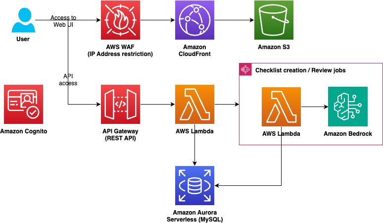

# Developer Guide

This guide summarizes information for developers working with this sample.

> [!Note]
> More than 80% of the code in this repository was written using AI coding tools such as [Amazon Q Developer CLI](https://docs.aws.amazon.com/amazonq/latest/qdeveloper-ug/command-line.html) and [Cline](https://github.com/cline/cline) with Bedrock. We recommend considering these tools when customizing this sample.

## Table of Contents

- [Architecture](#architecture)
- [Technology Stack](#technology-stack)
- [Local Development Environment](#local-development-environment)
- [Python Dependency Management](#python-dependency-management)
- [Coding Standards](#coding-standards)
- [Testing](#testing)
- [Deployment](#deployment)
- [Parameter Customization](#parameter-customization)

## Architecture



Architecture Overview:

1. **Frontend**:

   - [React](https://react.dev/) application hosted on [Amazon S3](https://aws.amazon.com/s3/)
   - Distribution via [Amazon CloudFront](https://aws.amazon.com/cloudfront/)
   - Security protection with [AWS WAF](https://aws.amazon.com/waf/)

2. **Authentication/Authorization**:

   - Authentication management with [Amazon Cognito](https://aws.amazon.com/cognito/)

3. **API Layer**:

   - [Amazon API Gateway](https://aws.amazon.com/api-gateway/)
   - [Fastify](https://fastify.dev/) REST API using [AWS Lambda](https://aws.amazon.com/lambda/) + [AWS Lambda Web Adapter](https://github.com/awslabs/aws-lambda-web-adapter)

4. **Processing Layer**:

   - Document processing workflows using [AWS Step Functions](https://aws.amazon.com/step-functions/)
   - Document analysis with [AWS Lambda](https://aws.amazon.com/lambda/) functions
   - AI/ML processing via [Amazon Bedrock](https://aws.amazon.com/bedrock/)

5. **Data Layer**:
   - Database using [Amazon RDS/Aurora](https://aws.amazon.com/jp/rds/) (MySQL)
   - Document storage using [Amazon S3](https://aws.amazon.com/s3/)

## Local Development Environment

### Prerequisites

- Node.js (v22 recommended)
- Docker and Docker Compose
- AWS CLI
- Python 3.9+ and Poetry (for Python components)

### Environment Setup

After deploying with CDK, follow these steps:

1. **Start Local Database**

   ```bash
   # Run in the root directory
   docker-compose -f assets/local/docker-compose.yml up -d
   ```

2. **Prepare Backend**

   ```bash
   cd backend
   npm ci

   # Generate Prisma client
   npm run prisma:generate

   # Start development server
   npm run dev
   ```

3. **Prepare Frontend**

   ```bash
   cd frontend
   npm ci

   # Set environment variables
   cp .env.example .env.local
   # Edit .env.local according to values after CDK deployment

   # Start development server
   npm run dev
   ```

## Python Dependency Management

This project uses [Poetry](https://python-poetry.org/) for Python dependency management in the following components:

- `backend/src/review-workflow/review-item-processor`
- `cdk/lib/constructs/mcp-runtime/python`

### Installing Poetry

```bash
curl -sSL https://install.python-poetry.org | python3 -
```

### Working with Python Components

1. Navigate to the Python component directory:

   ```bash
   cd backend/src/review-workflow/review-item-processor
   ```

2. Install dependencies:

   ```bash
   poetry install

   # Install local wheel package
   poetry run pip install ./run_mcp_servers_with_aws_lambda-0.2.1.post2.dev0+254672e-py3-none-any.whl
   ```

3. Run commands within the poetry environment:

   ```bash
   poetry run python your_script.py
   ```

   Or spawn a shell within the poetry environment:

   ```bash
   poetry shell
   ```

4. Add new dependencies:

   ```bash
   poetry add package-name
   ```

For more detailed instructions on using Poetry, refer to the README_POETRY.md file in each Python component directory.

## Coding Standards

Refer to [.amazonq/rules](../.amazonq/rules).

## DB Reset (Environment Cleanup)

If you need to reset the database, you can do so with the following command:

```bash
# Get and execute the reset command
RESET_COMMAND=$(aws cloudformation describe-stacks --stack-name RapidStack --query "Stacks[0].Outputs[?OutputKey=='ResetMigrationCommand'].OutputValue" --output text)
eval $RESET_COMMAND
```

> [!Warning]
> This will delete all data in the database. Never execute this in a production environment.

## Troubleshooting

1. **Docker-related Issues**

   - When deploying on macOS, ensure Docker is running.
   - CDK uses Docker to build Lambda functions.

2. **Migration Errors**

   - If automatic migration fails, check CloudWatch Logs for the "MigrationProviderLambda" function.
   - If the issue persists, you can try manual execution using the following methods:

     **Using AWS CLI**:

     ```bash
     # Get and execute the migration command from the Stack's Output
     MIGRATION_COMMAND=$(aws cloudformation describe-stacks --stack-name RapidStack --query "Stacks[0].Outputs[?OutputKey=='DeployMigrationCommand'].OutputValue" --output text)
     eval $MIGRATION_COMMAND
     ```

     **Using AWS Management Console**:

     1. Go to the Lambda service in the AWS Management Console
     2. Search for and select the Lambda function named `RapidStack-PrismaMigrationMigrationFunction~`
     3. Select the "Test" tab
     4. Set the following JSON as the test event
        ```json
        {
          "command": "deploy"
        }
        ```
     5. Click the "Test" button to execute

3. **Prisma Generation Errors**
   - If you encounter errors with the `prisma:generate` command, delete the `node_modules/.prisma` directory and try again.

4. **Poetry Issues**
   - If you encounter issues with Poetry:
     - Ensure you're running the latest version: `poetry self update`
     - Try clearing the Poetry cache: `poetry cache clear . --all`